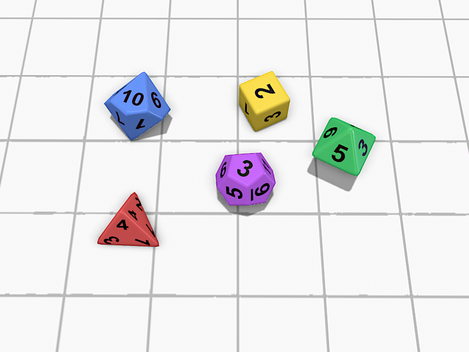
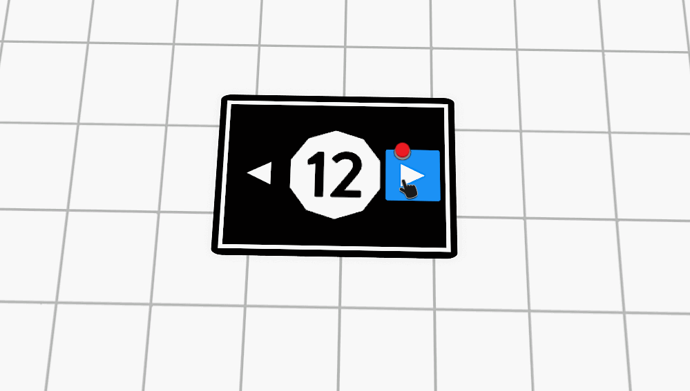

# Description

This repo contains graphics, meshes, and LUA scripts for personal use in the video game, Tabletop Simulator. Implemented are tools for roleplaying: custom character sheets, dynamic labels that change in realtime, and a customizable item container. The tools make extensive use of Tabletop Simulator's UI API, and more generally, HTML manipulation..

Shown above are meshes of typical roleplaying dice in .obj file format when loaded into Tabletop Simulator.

Labels make use of Tabletop Simulator's UI API. However, it is  cleverly implemented onto an object instead of the user's actual screen to have the effect shown.

This custom character sheet can be editted and changed through a rudimentry, but functioning, UI.